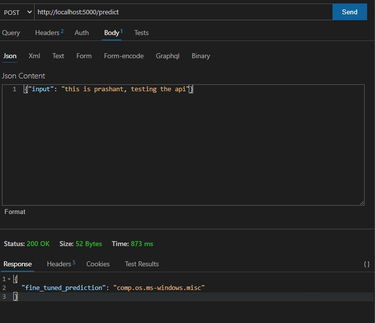

# Problem statement

Build a sentence classifier using sBert model on 20 Newsgroups dataset from sklearn

Steps:
1) create a custom loading class in pytorch to generate training triplets(anchor, positive example,negative example) from given dataset

2) Fine tuning pretrained model usign the concept of triplet training and triplet loss on our dataset

3) Implementing a approximate neighbour library (ANN) in our case we used google's Scann whhic benifits are explained below.

4) building a barebone KNN to classify the nearest neighbour from ANN index of embeddings

5) benchmarking 

## Triplet Generation strategy:

Usually in supervised learning we have a fixed number of classes and train the network using the softmax cross entropy loss. However in some cases we need to be able to have a variable number of classes. In NLP we need to be able to compare unknown text sentences and classify them according to known knowledge.

Triplet loss in this case is a way to learn good embeddings for our never seen custom dataset sentences. In the embedding space, sentences from the same class should be close together and form well separated clusters. Hence 

The goal of the triplet loss is to make sure that:

1) Two examples with the same label have their embeddings close together in the embedding space
2) Two examples with different labels have their embeddings far away

Simply speaking in our custom dataloader we will try to generate training triplets using pytorch Inputexample class (which is also compatible with triplets) in the form :

1)  an anchor
2)  a positive of the same class as the anchor
3)  a negative of a different class

A liitle bit addition I found out from Mnist Triplets embeddigs generation is that like images we can put a left and right padding to know the previous and next sentence in the corpus to contruct group examples. Next step is to construct the tuple such that we take multiple labels to benifits the loss function hence rejects the examples with single label as it won't serve much purpose in our loss function. 
Also, we need to tokenize the sentences like we do with images to train/finetune the model.  

A notebook is present in the repo which is used to finetune the model

## ANN : Google's scann explanation

An approximate nearest neighbor search algorithm return points, whose distance from the query are nearest by calcualting distance between embedding vectors. It also indexes the distances in a fast searchable data structure. It helps to speed up our tasks such as classification by just building a barebone classifier structure on top of it since classifier doesn't need to calculate/estimate distances.

There are few libraries I am aware of such that annoy, faiss, scann and KDtrees. honestly, I have used most of the times KDtress but for this purpose after doing some online research i decided to go with google's scann.

ScaNN (Scalable Nearest Neighbors) is a method for efficient vector similarity search at scale. it provides better tuning and different methods of indexing based on dataset size. so it uses methods specifically developed for dataset sizes by manually selecting the indexing methods for our data. 

Also, onvarious benchmarks it outperforms other ANNs by a big difference and have very good APIs structure in both pytorch and tensorflow. Also, can be scalable on distributed systems. 

## Pipeline

1) I built a pipeline.py file which contains all the functions to generate embeddings, compute indexes using knn and clasify for the prediction. 
2) It also benchmarks the pretrained and finetuned model performances.
3) prediction and benchmark functions are exposed to flask API which can be used to get prediction of the string & and benchmark the models.

## Benchmark accuracy

Pretrained model = ~ 45%
Finetuned model with single epocs = ~ 60%
Finetuned model with 3 - 4 epocs = ~ 80%

## Usage & files

All the project is build in a docker container via docker file.

### NOTE: fine tuned model is loacated at this link "https://drive.google.com/drive/folders/14B5VkaTfqpTEVnlG7VkQjy34HgzHxNUd?usp=sharing" 

### please download it and place it in "/src/required" folder before running the docker file.

To generate the docker image and test the APIs please use below commends (docker installation is prerequist):

1)  docker build -t bert_assign .
2) docker run -p 5000:5000 bert_assign

This will build your image and run the image which will ultimately run the APIs

API canbe asses on "http://localhost:5000/predict" route
below is sample input and output:

Benchmark API can be accessed at "http://localhost:5000/benchmark" requires no input. will provide you with the benchmark accuracy on test set for both the models. 

